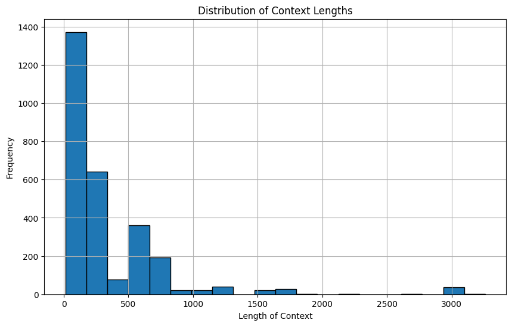

# Transport-Data-Gen
Collect, filter, and generate data from open-source transportation dataset


## change log

[2024/9/16] air dataset generated with `gpt-4o-mini` from not combined data with 17185 rows with `evolution` template was stored in `saves`

[2024/9/15] more modular in `src` folder, you can add your own prompts in `src/template.py`

[2024/9/12] add transGPT dataset; add evolution method for generating

[2024/9/11] support data augmentation on air travel dataset


## Info

- Air travel

[Reference](https://aistudio.baidu.com/datasetdetail/149933)

Refer to the data processing [code](https://aistudio.baidu.com/projectdetail/4388971?channelType=0&channel=0), we combine training and validation set together.

- TransGPT

[Reference](https://github.com/DUOMO/TransGPT)

Dataset for finetuning could be found at [here](https://huggingface.co/datasets/DUOMO-Lab/TransGPT-sft/blob/main/TransGPT-sft.json). This dataset isn't formatted well as `json`, we need to preprocess first. Here I transformed it into alpaca format.


### how to use

- air travel

In `air_travel` folder, run code listed in `gen_air_travel.sh` to generate data from scratch.

You can use default method or evolution method with breadth to do generation.

If you have generated `air_travel_combined.json` file already, you can try to generate augmented dataset. Just run code listed in `gen_augmented_air.sh`.

- transGPT

If you download the dataset from the source of transGPT, you need to make sure you set the proper file path for code `json_formatter.py` and then run it in `transGPT` folder.

- general

check more info about args in `src/datagen.py`, there are demo scripts listed in `examples/air_gen.sh`

### issues

#### raw dataset

- same content

e.g.
```
{"question": "儿童可不可以在网上值机选座啊", "context": "可以"}
{"question": "儿童可不可以在网上值机选座啊", "context": "可以"}
{"question": "儿童可不可以在网上值机选座啊", "context": "可以办理。"}
{"question": "儿童可不可以在网上值机选座啊", "context": "可以办理。"}
{"question": "儿童可不可以在网上值机选座啊", "context": "可以"}
{"question": "航空公司网上值机时间", "context": "可以"}
{"question": "航空公司网上值机时间", "context": "可以"}
```

- meaningless content

e.g.
```
{"question": "超规行李托运", "context": "说明："}
{"question": "能否托运宠物？两只小狗狗", "context": "；"}
{"question": "能否托运宠物？两只小狗狗", "context": "五."}
{"question": "能否托运宠物？两只小狗狗", "context": "$$table/cz3/cz_checked_luggage_live_animals78.txt$$"}
{"question": "航空公司网上值机时间", "context": "可以"}
{"question": "航空公司网上值机时间", "context": "可以"}
```

- some content need to be combined

e.g.
```
{"question": "机场信息", "context": "（2）国内值机区域："}
{"question": "机场信息", "context": "国内经济舱值机人工柜台主要分布在T2航站楼D区，包括经济舱值机、中转联程、特殊旅客服务、补交运、补班、售票、行李逾重等柜台，其中特殊旅客服务柜台位于D20，军人依法优先/消防救援人员优先柜台位于D13，中转联程柜台位于D26。"}
{"question": "机场无陪儿童服务多少钱", "context": "2）无成人陪伴青少年票价及服务费："}
```

- question and answer don't match

e.g.
```
{"question": "登飞机的行李箱是多大尺寸", "context": "2.在您的上述随身物品额度之外，您还可以免费携带以下物品："}
{"question": "伟哥怎么过飞机安检", "context": "（7）国内/国际运输总条件规定的小动物、服务犬；"}
```

- redundant or useless tokens(like space, and etc.)

e.g.
```
{"question": "我 要 值机", "context": "登机牌可在机场办理，也可通过自助设备、南航网站等方式办理；如需托运行李必须在机场柜台截止办理时间前抵达人工办理柜台，各地规定不同，请咨询始发当地机场。持纸质客票的旅客请到机场柜台办理。"}
{"question": "航空公司 行李", "context": "国内航程 国际或地区航程 *此行李运输规则于2020年12月8日（以系统销售日期为准）起实施。 （1）韩国与中国境内（不含港澳台地区）双向之间的品牌运价产品的免费托运行李额 （2）使用非上述行程的其他品牌运价产品或无品牌运价产品的免费托运行李额"}
```

#### augmentation

- multi workers code seems have some problems currently(time out issue), and need to be fixed.

- need more precise processing and prompts.

### advanced

For `air_travel_combined.json`, it has 2814(about 3k) rows, if we want to get 10k dataset, all we need to do is to let the LLM generate 4 related data(just logically tear the seed data apart) from an observation.

The Chinese characters counting info is shown below:




## Concerned

1. Need to write the data collection and processing process.
2. Perform data statistics, such as the approximate number of various types of data.